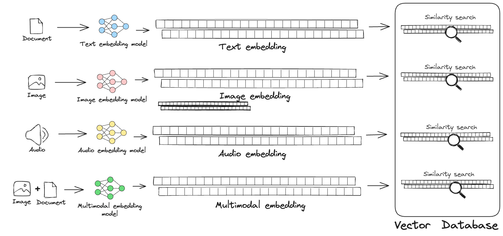
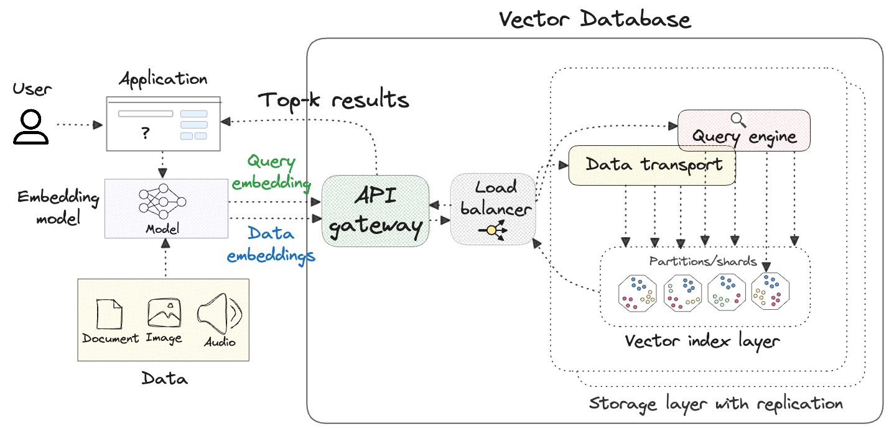

<!-- What is vector search, and how can vector databases help? -->

# Vector Search


## The exponential growth of data

It's no secret that most organizations worldwide are experiencing exponential growth in the amount of structured and unstructured data they store. According to [IDC](https://www.idc.com/getdoc.jsp?containerId=US50397723), the vast majority - at least 80% - of all data in any given organization is unstructured, and by 2025, the total amount of unstructured data is expected grow to 175 zettabytes (175 billion terabytes). More data is expected to be generated in the next five years than in the last ten! 🤯

Modern machine learning models (e.g., transformers) have made it possible to derive insights from unstructured data at scale, but the growth of this form of data has introduced new challenges. Traditional databases are not well-suited to handle unstructured data, and over the last few years, we've seen the rise in popularity of a new class of search engines and databases designed specifically for querying unstructured data.

## The early days of search

Search systems that can retrieve information from unstructured text data have been around since the [1970s](https://en.wikipedia.org/wiki/IBM_STAIRS). In the early days of the web, keyword-based search engine libraries like Lucene began using inverted indexes to improve search relevance and speed when querying large collections of data. Inverted indexes are data structures that map keyword frequencies relative to the documents in which they appear. Because these methods search on the entire collection of texts at once, they're referred to as *full-text* search.

The limitation of full-text search is that it retrieves only those results that have at least a partial match with keywords in the query. Although techniques like phrase search, proximity search or fuzzy search can be used to improve relevance, it's still not very effective when the user query consists of synonyms or semantically similar terms. For example, a search for "car" will not return documents that contain the word "automobile", even though that's what the user might have wanted.

Another limitation of full-text search is that it can't handle non-textual data (images or audio) or multi-modal data (images or audio with descriptions). For example, a user searching for a product on an e-commerce website or music app may want to find similar items based on their source and descriptions. Simply searching for keywords in the description may not yield relevant results.

## Introducing vector search

Vector search leverages machine learning models to consider the semantics (i.e., the meaning) of unstructured data when performing search. This is done by converting the data into a numerical representation, termed a vector.

In computer science, a vector is a one-dimensional array of numbers (typically floating point numbers).

```py
example_4d_vector = [0.1234, 0.3035, 0.9876]
```

The length of a vector is called its dimensionality, and in the context of machine learning, high-dimensional vectors play a critical role in representing data in a way that computers can better interpret. The example above shows a 3-D vector, but the vectors used in machine learning typically have hundreds (or thousands) of dimensions.

Vectors are generated by passing data through the layers of a trained neural network. For example, a transformer-based model like [SentenceBERT](https://www.sbert.net/docs/pretrained_models.html) can be used to convert a sentence/document into a a numerical representation that represents the semantic meaning of the sentence in vector space.

A toy example in 3-D space is shown below. Vectors for semantically similar sentences are closer together than those that represent dissimilar sentences or concepts.


The power of vectors lies in their multimodal nature -- they can just as well represent images or audio clips as they can text, depending on the model used to generate them. This makes them a powerful tool for building search systems that can handle multi-modal data.

:::hint{style="info"}
The terms *vector* and *embedding* are often used interchangeably, or sometimes even together, as *vector embedding*. In the context of vector search, they all mean the same thing.
:::

### Distance metrics

The similarity between two vectors is quantified via a distance metric. A few commonly used distance metrics are listed below.

* Euclidean (L2) distance
* Dot product similarity
* Cosine similarity

Cosine similarity, which considers the angle between two vectors, is commonly used in measuring the similarity between texts. Two vectors that are very dissimilar can be thought of as orthogonal to each other in vector space, with a cosine similarity of zero. On the other hand, vectors that are very similar to one another will have a cosine similarity close to 1, with a limiting value of 1 being the case where a given vector is always identical to itself.

### The power of vector search

Vector search distinguishes itself from lexical or keyword search by being able to return results that are semantically similar, even when the exact keywords aren't present in the query. Additionally, because of the general-purpose nature of vector embeddings, they can be used to represent almost any form of data, including text, images and audio. Multimodal embedding models like [CLIP](https://github.com/openai/CLIP) can generate a single embedding for multiple forms of data, such as images and their descriptions.




However, simply generating the vectors and measuring their similarities isn't *useful* unless we can search through large amounts of data very quickly.

## What is a vector database?

A vector database is a purpose-built system designed to store and perform semantic (similarity) search at scale. The raw search is performed by comparing the query vector with the vectors stored in the database, and returning the top-k most similar ones.

The figure below shows some of the key underlying components of a vector DB -- not all DB vendors may represent their internals this way, but the same principles generally apply.



### Vector databases vs. vector search libraries

What *makes* a vector DB? Why can't we just use a regular database and store vectors natively as arrays? The answer lies in the underlying data structures, indexing algorithms and other key features that enable vector DBs to perform similarity search at scale.

- A vector index allows fast and efficient retrieval of similar vectors
- A query engine that performs optimized similarity computations on the index
- Partitioning/sharding to enable horizontal scaling
- Replication and other reliability features
- An accessible API that allows for efficient vector CRUD operations

It's for these reasons that well-known open-source projects like [FAISS](https://github.com/facebookresearch/faiss), [SCANN](https://github.com/google-research/google-research/tree/master/scann) and [Hnswlib](https://github.com/nmslib/hnswlib) are considered vector search *libraries*, rather than full-fledged databases.
 
## Breakdown of the vector DB landscape

Broadly speaking, vector DBs can be broken down to three categories:

- **Vector-native**: Purpose-built DBs that optimize for vector search while making vector embeddings first-class citizens
- **Hybrid**: Existing DBs that have added vector search capabilities
- **Search engines**: Systems that natively support search and relevance ranking on unstructured data via an underlying index

Although there is a strong overlap in capabilities across these categories, search engines are kept in their own category because they're typically not used as the primary database or for storing raw data. They're often used to index data that's already present in other databases or data lakes.

::::tabs
:::tab{title="Vector-native DBs"}
| Name | Built in | Open-source | Managed cloud | Self-hosting |
| ---------- | :-: | :-: | :-: | :-: |
| Weaviate | Go | ✅ | ✅ | ✅ |
| Qdrant | Rust | ✅ | ✅ | ✅ |
| Milvus | Go | ✅ | ✅ | ✅ |
| Zilliz | Go | ❌ | ✅ | ❌ |
| Chroma | C++ | ✅ | Upcoming | ✅ |
| LanceDB | Rust | ✅ | Upcoming | ✅ |
| Deeplake | C++ | ✅ | ❌ | ✅ |
| Pinecone | Rust | ❌ | ✅ | ❌ |
| MyScale | C++ | ❌ | ✅ | ❌ |
| AstraDB | Java | ❌ | ✅ | ❌ |
:::

:::tab{title="Hybrid DBs"}
| Name | Built in | Open-source | Managed cloud | Self-hosting |
| ---------- | :-: | :-: | :-: | :-: |
| Redis | C | ✅ | ✅ | ✅ |
| Postgres (pgvector) | C++ | ✅ | ❌ | ✅ |
| MongoDB | C++ | ✅ | ✅ | ❌ |
| ClickHouse | C++ | ✅ | ✅ | ✅ |
| Neo4j | Java | ✅ | ✅ | ✅ |
:::

:::tab{title="Search engines"}
| Name | Built in | Open-source | Managed cloud | Self-hosting |
| ---------- | :-: | :-: | :-: | :-: |
| Vespa | C++ | ✅ | ✅ | ✅ |
| Vald | Go | ✅ | ✅ | ✅ |
| ElasticSearch | Java | ❌ | ✅ | ✅ |
| OpenSearch | Java | ❌ | ✅ | ❌ |
| Meilisearch | Rust | ✅ | ✅ | ✅ |
| Typesense | C++ | ✅ | ✅ | ✅ |
:::
::::

There is some debate on the distinction between a search engine and a vector DB, but in general, a lot of these tools offer variations of the same functionality -- the ability to store and query vectors at scale.

## Additional considerations

When designing a vector search system with cost, latency and quality in mind, aside from the choice of underlying database, it's important to keep the following points in mind.

### Context length for embedding models

Embedding models have a maximum context length, which is the maximum length of a sequence of tokens that can be embedded into a given vector (in [English](https://help.openai.com/en/articles/4936856-what-are-tokens-and-how-to-count-them), 100 tokens equal roughly 75 words). For many open-source embedding models, the maximum context length is in the range of 384 to 1024 tokens.

Using an embedding model on long-form texts would mean that the entire text cannot be embedded into a single vector, and would need to be split into smaller chunks, or by using a windowing approach. Libraries like LangChain and LlamaIndex can help with this.

### Relevance ranking

To improve search relevance when an exact match between keywords in the query and the results are required, several vector DBs and search engines offer hybrid search options that combine top-k scores from keyword and vector search. Research from [Google](https://arxiv.org/abs/2201.10582) shows that using Reciprocal Rank Fusion (RRF) to re-rank search results using a combination of keyword and vector search can improve search relevance by up to 20%.

A more sophisticated method to improve relevance exist, such as re-ranking via [cross-encoders](https://www.sbert.net/examples/applications/cross-encoder/README.html). This approach uses a transformer-based model downstream of the vector DB that generates new scores for the top-k results returned by the DB. This approach is more computationally expensive, but can yield better results than RRF, at the expense of latency and added system complexity.

## Conclusions

In this article, we covered the basics of vector search and how it's useful. A modern semantic search & retrieval system utilizes a number of specialized components, including embedding models, vector databases and re-ranking modules. We'll be going deeper into some of the components as well as interesting use-cases for vector search in other articles.

---
## Contributors

- [Prashanth Rao](https://twitter.com/tech_optimist)